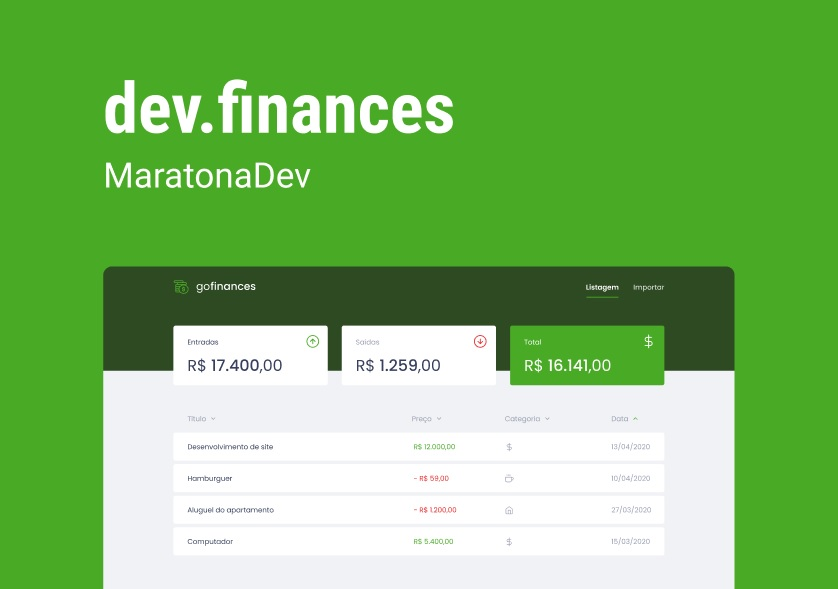

<h1 align="center">Maratona Discover, project "dev.finance$".</h1>

<h2 align="center">About</h2>
   
   <p align="center">
      The dev.finance$ project, developed during the Maratona Discover, from <a href="https://rocketseat.com.br/">Rocketseat</a>, from the 14th January to the 04th of February.<br>
      
   </p>

- 🔄 "Application structure with HTML"
- 🔄 "CSS styling"

---

<h2 align="center">Preview</h2>

   <p align="center">
      
   </p>

---

<h2 align="center">Layout 🎨</h2>

   <p align="center">
      The Layout was developed by <a href="https://instagram.com/tiagoluchtenberg">Tiago Luchtenberg</a>, and you can access it on Figma:
      
   <a href="https://www.figma.com/file/MXnGU5AsEuXQUTfD2KbZWN/dev.finance%24-Maratona-Discover-(Copy)?node-id=5154%3A131"></a>  
   </p>

---

<h2 align="center">Technologies 🚀</h2>

- [JavaScript](https://www.javascript.com/)
- [CSS](https://developer.mozilla.org/pt-BR/docs/Web/CSS)
- [HTML](https://html.com/)

---

<h2 align="center">Notion Files 📋</h2>

- [Aula 1](https://www.notion.so/Aula-01-45744a4c8a0c455eaa70fcb3e0c9f79c)

---

<h2 align="center">How to Use 🤔</h2>

```
- Clone this repository:
$ git clone https://github.com/alexlopesbr/FinanceApp-Maratona-Discover.git

- Open index.html in your browser
```

---

<h2 align="center">How to Contribute 💪</h2>

```
- Fork the project

- Create a new branch with your changes:
$ git checkout -b my-feature

- Save your changes and create a commit message telling you what you did:
$ git commit -m "feature: My new feature"

- Submit your changes:
$ git push origin my-feature
```

---

> This project was developed with ❤️ by **[@Alexandre Lopes](https://www.linkedin.com/in/aleflopes/)**, with the instructor **[@MaykBrito](https://linkedin.com/in/maykbrito)**, during the **[Maratona Discover](https://rocketseat.com.br/)** of **[Rocketseat](https://www.linkedin.com/school/rocketseat/about/)** 💜. <br>
> If it helped you, give it ⭐, it will help me too 😉 The README design was kindly made available by **[@Felipe Sales](https://github.com/felipecastrosales) and altered by me**

---

   <div align="center">

[](https://www.linkedin.com/in/aleflopes/)

   </div>
